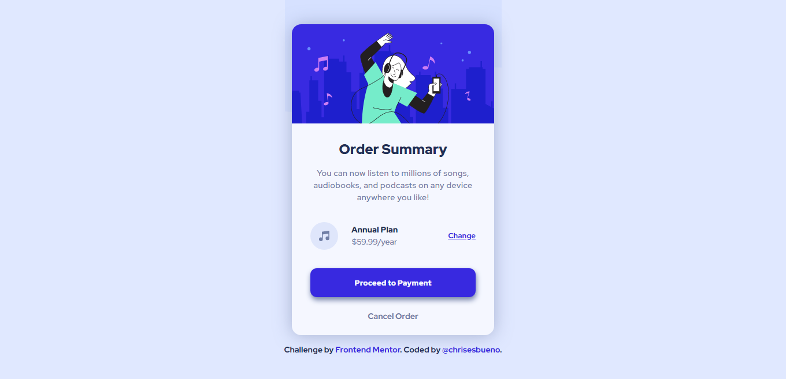

# Frontend Mentor - Order summary card solution

This is a solution to the [Order summary card challenge on Frontend Mentor](https://www.frontendmentor.io/challenges/order-summary-component-QlPmajDUj). Frontend Mentor challenges help you improve your coding skills by building realistic projects. 

## Table of contents

- [Overview](#overview)
  - [The challenge](#the-challenge)
  - [Screenshot](#screenshot)
  - [Links](#links)
- [My process](#my-process)
  - [Built with](#built-with)
  - [What I learned](#what-i-learned)
- [Author](#author)
## Overview

### The challenge

Users should be able to:

- See hover states for interactive elements

### Screenshot



### Links

- Solution URL: [Add solution URL here](https://your-solution-url.com)
- Live Site URL: [Add live site URL here](https://your-live-site-url.com)

## My process

### Built with

- Semantic HTML5 markup
- CSS custom properties
- Flexbox
- CSS Grid
- Mobile-first workflow

### What I learned

```css
.change {
    color: var(--bright-blue);
    font-weight: 700;
    font-size: 13px;
}
.change:hover {
    color: hsla(245, 75%, 52%, 0.768);
}
.payment {
    width: 100%;
    height: 50px;
    font-family: 'Red Hat Display';
    font-weight: 900;
    color: var(--very-pale-blue);
    background-color: var(--bright-blue);
    border: none;
    border-radius: 0.7rem;
    margin-bottom: 1.5rem;
    box-shadow: 1px 5px 10px var(--desaturated-blue);
    cursor: pointer;
}
.payment:hover {
    background-color: hsla(245, 75%, 52%, 0.668);
}
.cancel {
    font-weight: 700;
    color: var(--desaturated-blue);
    font-size: 14px;
    cursor: pointer;
}
.cancel:hover {
    color: var(--dark-blue);
}
```

## Author

- Frontend Mentor - [@chrisesbueno](https://www.frontendmentor.io/profile/chrisesbueno)
- Twitter - [@chrisesbueno](https://www.twitter.com/chrisesbueno)

